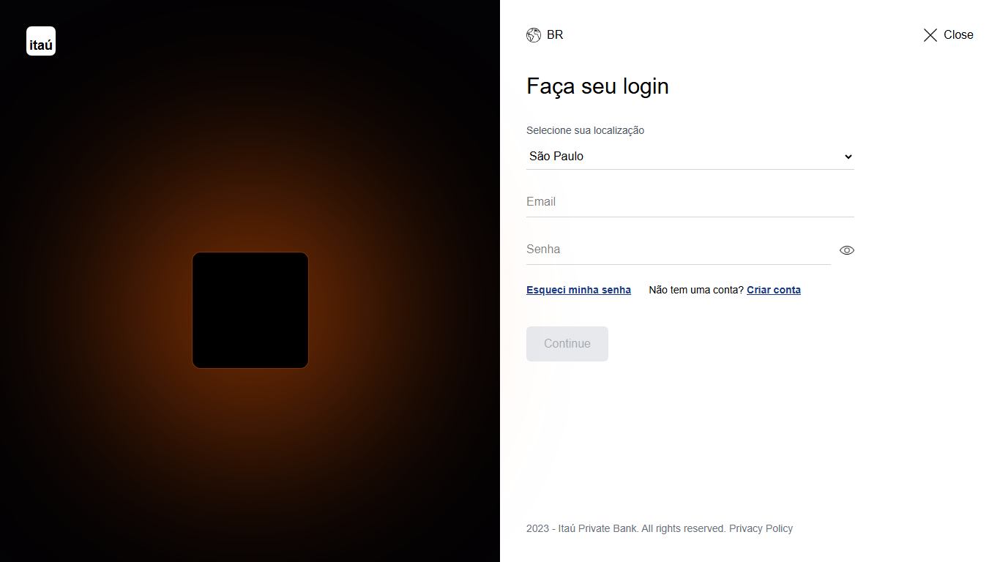
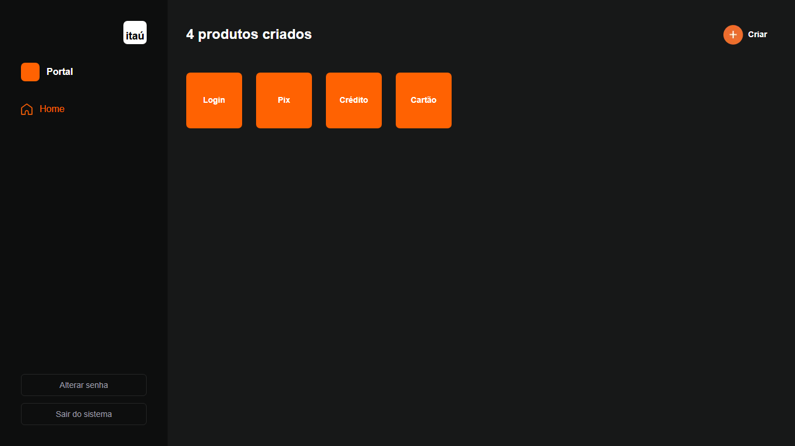

# 🚀 Desafio Técnico - Portal de Produtos

Este projeto é uma aplicação Fullstack desenvolvida como parte de um teste técnico. O objetivo principal é oferecer uma plataforma segura e intuitiva para a gestão de produtos, contando com um sistema completo de autenticação e persistência de dados em tempo real.

## 📋 Resumo do Projeto

O Portal de Produtos é uma ferramenta desenvolvida para simular um ambiente administrativo onde usuários podem se cadastrar, realizar login com segurança e gerenciar (Criar, Ler, Atualizar e Deletar) sua própria lista de produtos. A aplicação foca fortemente em **segurança de dados** e **experiência do usuário (UX)**.

---

## 📸 Screenshots

### Tela de Login e Portal de Produtos

  
  

---

## 🔗 Links

*   **Repositório:** [Acesse o repositório aqui](https://github.com/jsales25/teste-tecnico-itau)
*   **Deploy (Vercel):** [Acesse o site aqui](https://portal-de-produtos-itau.vercel.app/)
> *Nota: Por ser um projeto que utiliza banco de dados e autenticação via API, ele foi publicado na Vercel para pleno funcionamento (Github Pages é apenas para sites estáticos).*

---

## 🛠️ Tecnologias Utilizadas

*   **Frontend:** [Next.js](https://nextjs.org/) (App Router), [React](https://reactjs.org/), [Tailwind CSS](https://tailwindcss.com/).
*   **Backend:** Next.js API Routes.
*   **Banco de Dados:** [Neon](https://neon.tech/) (PostgreSQL) com [Prisma ORM](https://www.prisma.io/).
*   **Autenticação:** [JWT](https://jwt.io/) (JSON Web Tokens) com armazenamento em Cookies **HttpOnly** para maior segurança.
*   **Validação:** [Zod](https://zod.dev/) e [React Hook Form](https://react-hook-form.com/).
*   **Criptografia:** [Bcryptjs](https://www.npmjs.com/package/bcryptjs) para hashing de senhas.

---

## 🧠 O que eu aprendi

Durante o desenvolvimento deste projeto, pude consolidar conhecimentos fundamentais de engenharia de software:

1.  **Segurança em Camadas:** Implementei o uso de Cookies `HttpOnly` para armazenar o Token JWT, o que protege a aplicação contra ataques XSS, além de usar hashing `bcrypt` para nunca salvar senhas em texto puro.
2.  **Arquitetura e Reutilização:** Criei um serviço centralizado de API (`src/lib/api.ts`) que automatiza headers e tratamento de erros, facilitando a manutenção do código.
3.  **Experiência do Usuário (UX):** Desenvolvi um sistema de notificações flutuantes (Toasts) via Context API e validações em tempo real nos formulários, garantindo que o usuário receba feedback imediato.
4.  **Modelagem de Dados:** Utilizei o Prisma para gerenciar o relacionamento entre Usuários e Produtos, garantindo integridade referencial.

---

## 👤 Autora

Desenvolvido por **Julia Sales**

*   **GitHub:** [Acesse o GitHub da autora aqui](https://github.com/jsales25)
*   **LinkedIn:** [Acesse o LinkedIn da autora aqui](https://linkedin.com/in/julia-sales-developer)

---

  Desenvolvido com 💜 por Julia Sales

